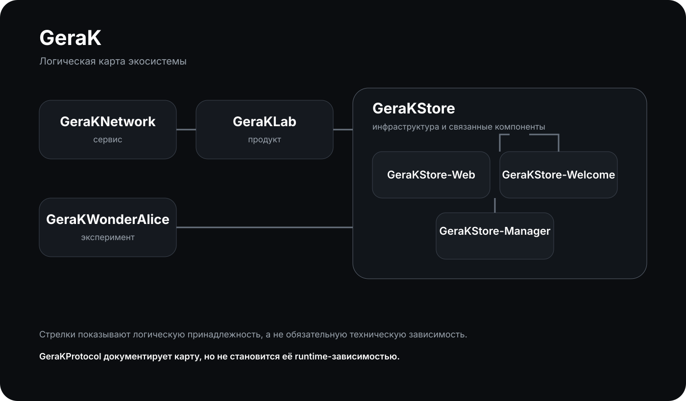
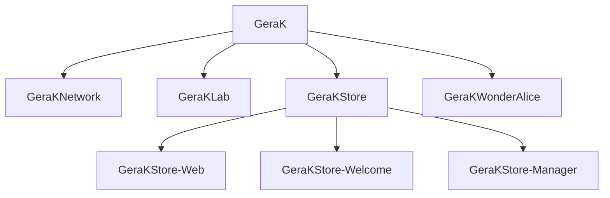

<div align="center">

# GeraKProtocol

### Техническая документация экосистемы GeraK

**1.0.0** · 🟢 Актуален · 🇷🇺 Открытая документация

> **Понять GeraK целиком, не открывая семь репозиториев по очереди.**

</div>

---

GeraKProtocol объясняет, **что такое GeraK, какие проекты в него входят, как они связаны и какой общий характер у экосистемы**.

Это отдельный публичный репозиторий. Он не является библиотекой, SDK, фреймворком, пакетом или runtime-зависимостью.

---

## 🧬 GeraK целиком





Схема показывает **логическую структуру экосистемы**, а не список программных зависимостей.

GeraKStore-Web, GeraKStore-Welcome и GeraKStore-Manager относятся к экосистеме GeraKStore. Это не означает, что между ними обязательно существует техническая зависимость.

**→ [Подробнее об экосистеме](ЭКОСИСТЕМА.md)**

---

## ⚡ Проекты

| Проект | Роль | Статус |
|---|---|---|
| [GeraKNetwork](https://github.com/gkuhtov/GeraKNetwork) | Сервис | 🟢 Активен |
| [GeraKLab](https://github.com/gkuhtov/GeraKLab) | Продукт | 🧪 Развивается |
| [GeraKStore](https://github.com/gkuhtov/GeraKStore) | Инфраструктура | 🟢 Активна |
| [GeraKStore-Web](https://github.com/gkuhtov/GeraKStore-Web) | Веб-интерфейс | 🟢 Активен |
| [GeraKStore-Welcome](https://github.com/gkuhtov/GeraKStore-Welcome) | Компонент | 🟢 Активен |
| [GeraKStore-Manager](https://github.com/gkuhtov/GeraKStore-Manager) | Инструмент | 🟢 Активен |
| [GeraKWonderAlice](https://github.com/gkuhtov/GeraKWonderAlice) | Эксперимент | 🧪 Развивается |

Экосистема не ограничена этим списком. Новые проекты могут появляться без необходимости переделывать уже существующие.

**→ [Полный каталог проектов](ПРОЕКТЫ.md)**

---

## 🧠 Что такое GeraK

GeraK — это **экосистема самостоятельных проектов, сервисов, инструментов и экспериментов**.

У проектов могут быть разные:

- языки программирования;
- платформы;
- архитектуры;
- визуальные решения;
- темп развития;
- назначение.

И это нормально.

Общее находится не на уровне исходного кода, а на уровне **идеи, характера, понятности и узнаваемости**.

> **GeraK не делает проекты одинаковыми. Иначе это была бы просто очень большая папка.**

---

## 🧩 Главное правило

### Логическая связь ≠ техническая зависимость

Проекты могут относиться к одной экосистеме, использовать общее имя, решать связанные задачи или образовывать целую систему.

При этом они остаются самостоятельными.

**GeraKProtocol находится ещё выше:**

```text
GeraKProtocol
      │
      ├── описывает
      ├── объясняет
      └── связывает на уровне документации
             │
             ├── GeraKNetwork
             ├── GeraKLab
             ├── GeraKStore
             └── GeraKWonderAlice
```

GeraKProtocol ничего не импортирует и не устанавливает. Ни один проект не обязан подключать его для работы.

> **Документация знает о проектах. Проекты не обязаны знать о документации.**

**→ [Подробнее об архитектуре](АРХИТЕКТУРА.md)**

---

## 🎨 Характер GeraK

GeraK должен ощущаться единым, даже если проекты выглядят по-разному.

Базовый характер:

| Принцип | Что это значит |
|---|---|
| **Технический** | Проекты остаются настоящими инженерными продуктами |
| **Современный** | Чистый интерфейс, ясная структура, актуальные технологии |
| **Живой** | Экосистема не выглядит как корпоративный архив |
| **Аккуратный** | Визуальный шум не заменяет содержание |
| **С характером** | Юмор допустим, когда он помогает проекту |
| **Свободный** | Конкретный проект не загоняется в одну форму |

Фирменный ориентир:

> **Серьёзно к проектам. Не слишком серьёзно к себе.**

Юмора немного. Инженерии много.

**→ [Подробнее о стиле](СТИЛЬ.md)**

---

## 🧭 Быстрый вход

| Нужно понять | Открыть |
|---|---|
| Что такое GeraKProtocol | **[ПРОТОКОЛ](ПРОТОКОЛ.md)** |
| Какие проекты существуют | **[ПРОЕКТЫ](ПРОЕКТЫ.md)** |
| Как устроена экосистема | **[ЭКОСИСТЕМА](ЭКОСИСТЕМА.md)** |
| Как читать связи между проектами | **[АРХИТЕКТУРА](АРХИТЕКТУРА.md)** |
| Какой у GeraK характер | **[СТИЛЬ](СТИЛЬ.md)** |
| Как всё начиналось | **[ИСТОРИЯ](ИСТОРИЯ.md)** |

---

## 📚 Навигация

| Документ | Назначение |
|---|---|
| **[ПРОТОКОЛ](ПРОТОКОЛ.md)** | Что такое GeraKProtocol и какие принципы он задаёт |
| **[ЭКОСИСТЕМА](ЭКОСИСТЕМА.md)** | Карта GeraK и место каждого проекта |
| **[ПРОЕКТЫ](ПРОЕКТЫ.md)** | Каталог репозиториев |
| **[АРХИТЕКТУРА](АРХИТЕКТУРА.md)** | Логические связи и границы проектов |
| **[СТИЛЬ](СТИЛЬ.md)** | Визуальный и текстовый язык GeraK |
| **[ИСТОРИЯ](ИСТОРИЯ.md)** | Как формировалась экосистема и протокол |

---

## 🔬 Что именно стандартизирует протокол

GeraKProtocol **не диктует**, на чём писать приложение.

Он не требует:

- конкретного языка;
- конкретного фреймворка;
- конкретной архитектуры;
- одинаковой структуры исходного кода;
- одинакового UI.

Он описывает другое:

- как проект представлен внутри экосистемы;
- как объясняется его назначение;
- как обозначаются связи;
- как сохраняется узнаваемость GeraK;
- как экосистема может расти без лишней бюрократии.

### Сила правил

🔴 **ОБЯЗАТЕЛЬНО** — действительно важная часть протокола.

🟡 **РЕКОМЕНДУЕТСЯ** — хороший общий ориентир.

🔵 **ПО НЕОБХОДИМОСТИ** — используется, когда это имеет смысл для конкретного проекта.

---

## 📡 Версия

**Текущая версия:** `1.0.0`

Формат: **MAJOR.MINOR.PATCH**

Версия протокола может развиваться независимо от версий самих проектов.

Старый проект не обязан мгновенно соответствовать новой версии протокола. Экосистема развивается постепенно.

**→ [Полная спецификация](ПРОТОКОЛ.md)**

---

<div align="center">

### GeraKProtocol · 1.0.0

*Открытая карта экосистемы GeraK.*

**Документация тоже является частью проекта.**

</div>
