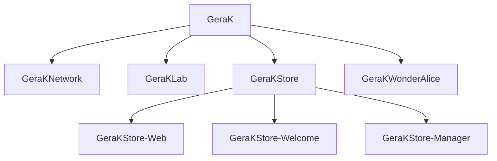
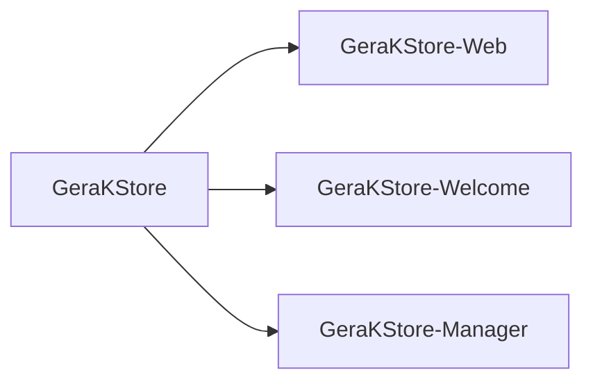
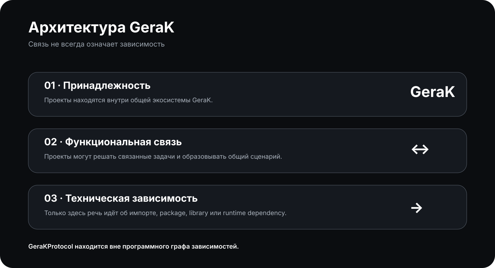

# АРХИТЕКТУРА

> **ПРОТОКОЛ 04 · АРХИТЕКТУРА**

**Версия:** 1.0.0  
**Состояние:** 🟢 Актуальна

Архитектура GeraK описывает не внутренний код каждого приложения, а **структуру самой экосистемы**.

Главный принцип:

> **GeraK является экосистемой самостоятельных проектов, а не одним большим программным продуктом.**

---

## 🧭 Архитектура верхнего уровня



Эта схема показывает **место проектов в экосистеме**.

Она не описывает внутреннюю реализацию приложений и не является графом package dependencies.

---

## 🧱 Четыре типа проектов

Для навигации проекты можно рассматривать через их роль.

| Тип | Назначение | Пример |
|---|---|---|
| **Сервис** | Предоставляет сервисную или инфраструктурную функцию | GeraKNetwork |
| **Продукт** | Самостоятельный пользовательский проект | GeraKLab |
| **Инфраструктура** | Обеспечивает отдельное направление экосистемы | GeraKStore |
| **Инструмент / компонент** | Выполняет специализированную функцию | GeraKStore-Manager, GeraKStore-Web |
| **Эксперимент** | Исследует идею или технологическое направление | GeraKWonderAlice |

Эта классификация нужна для понимания экосистемы, а не для ограничения проектов.

Один проект со временем может изменить свою роль.

---

## 🔗 Три уровня связи

В GeraK полезно различать три разных уровня.

### 1. Принадлежность

Проект является частью экосистемы GeraK.

Это самая общая связь.

```text
GeraK
 ├── GeraKNetwork
 ├── GeraKLab
 ├── GeraKStore
 └── GeraKWonderAlice
```

---

### 2. Функциональная связь

Проекты решают связанные задачи или образуют одно направление.

Например:

```text
GeraKStore
 ├── Web
 ├── Welcome
 └── Manager
```

Это означает, что они относятся к одной системе магазина на уровне функций и назначения.

---

### 3. Техническая зависимость

Это уже конкретная программная связь.

Например:

```text
Проект A
   │
   └── использует API / пакет / библиотеку
                │
                ▼
            Проект B
```

Такая зависимость существует только тогда, когда её можно подтвердить технически.

Наличие двух проектов на одной схеме **само по себе не является доказательством зависимости**.

---

## ⚠️ Не путать уровни

| Связь | Что означает | Это dependency? |
|---|---|---|
| Принадлежность GeraK | Проект относится к экосистеме | ❌ Нет |
| Общее направление | Проекты решают связанные задачи | ❌ Не обязательно |
| Общий пользовательский сценарий | Пользователь может использовать их вместе | ❌ Не обязательно |
| Обмен данными | Проекты взаимодействуют | 🟡 Возможно |
| API | Один проект обращается к другому | 🟡 Зависит от реализации |
| Package / library | Код одного проекта используется другим | 🔴 Да |
| Runtime service | Один проект не работает без другого | 🔴 Да |

Это различие является одним из основных архитектурных принципов GeraKProtocol.

---

## 🧩 Независимость проектов

Самостоятельность означает, что проект должен иметь собственное:

- назначение;
- исходный код;
- жизненный цикл;
- версионирование;
- способ сборки или запуска;
- документацию, когда она необходима.

При этом проект может добровольно использовать внешние сервисы, API, библиотеки или другие проекты.

Независимость не означает отсутствие интеграций.

Она означает отсутствие **необоснованной связанности**.

---

## 🏪 Архитектура GeraKStore

GeraKStore представляет отдельное направление внутри общей экосистемы.

На логическом уровне:



Компоненты имеют разные роли:

- **GeraKStore** — основа направления магазина;
- **GeraKStore-Web** — веб-представление;
- **GeraKStore-Welcome** — пользовательский компонент;
- **GeraKStore-Manager** — рабочий инструмент управления.

Их нахождение в одной группе показывает принадлежность к одному направлению.

Конкретные технические зависимости должны определяться самими проектами и подтверждаться их кодом и документацией.

---

## 📡 Где находится GeraKProtocol

GeraKProtocol располагается **над уровнем проектов как документационный слой**.

```text
                    GeraKProtocol
                         │
          ┌──────────────┼──────────────┐
          │              │              │
       описывает      объясняет       связывает
          │              │              │
          └──────────────┼──────────────┘
                         │
                  Экосистема GeraK
                         │
       ┌─────────┬───────┼───────┬─────────┐
       ▼         ▼       ▼       ▼         ▼
    Network     Lab    Store   WonderAlice  ...
```

Это **документационный уровень**, а не программный.

GeraKProtocol:

- не импортируется;
- не устанавливается;
- не требуется для запуска;
- не предоставляет runtime-функции;
- не является общей библиотекой;
- не должен становиться скрытой инфраструктурной зависимостью.

> **Документация знает о проектах. Проекты не обязаны знать о документации.**

---



## 🗺️ Как должна читаться архитектура

При просмотре любой схемы GeraK нужно сначала спросить:

**Что именно показывает эта схема?**

Возможны разные ответы:

- принадлежность;
- функциональная связь;
- пользовательский сценарий;
- обмен данными;
- техническая зависимость;
- документационная связь.

Если тип связи не указан, схема может создавать ложное впечатление.

Поэтому GeraKProtocol предпочитает **явно объяснять смысл стрелок**, а не заставлять читателя угадывать его.

---

## 🔄 Архитектура может изменяться

Экосистема не заморожена.

Проект может:

- получить новое назначение;
- стать отдельным направлением;
- получить дополнительные компоненты;
- перестать развиваться;
- быть заменён;
- объединиться с другим проектом;
- появиться в новой форме.

Изменение архитектуры экосистемы не требует ломать старые проекты.

GeraKProtocol должен отражать реальное состояние системы, а не заставлять систему соответствовать старой схеме.

---

## 🧠 Архитектурный принцип

GeraKProtocol стремится к простой модели:

```text
Меньше скрытых связей
        +
Больше понятных границ
        +
Свобода реализации
        =
Устойчивая экосистема
```

Проектам не нужно быть одинаковыми.

Им нужно быть **понятными**.

---

## 📚 Связанные документы

- [ПРОТОКОЛ](ПРОТОКОЛ.md)
- [ЭКОСИСТЕМА](ЭКОСИСТЕМА.md)
- [ПРОЕКТЫ](ПРОЕКТЫ.md)
- [СТИЛЬ](СТИЛЬ.md)
- [ИСТОРИЯ](ИСТОРИЯ.md)

---

<div align="center">

**GeraKProtocol · Architecture**

*Связи должны быть понятными. Границы должны быть настоящими.*

</div>
