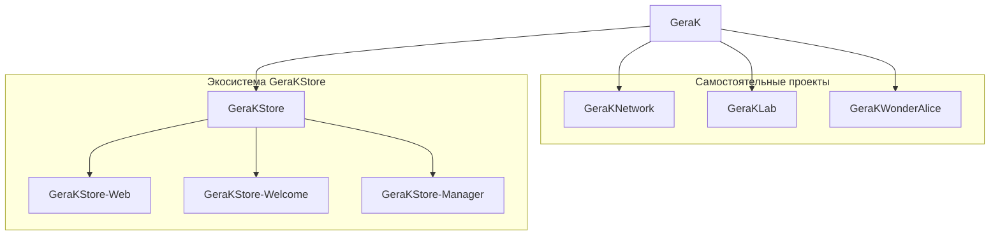

# ЭКОСИСТЕМА

> **ПРОТОКОЛ 02 · ЭКОСИСТЕМА**

**Версия:** 1.0.0  
**Состояние:** 🟢 Актуальна

Эта страница отвечает на один вопрос:

> **Из чего состоит GeraK и как его проекты связаны между собой?**

GeraK не является одним приложением или одним программным продуктом. Это экосистема самостоятельных проектов, которые объединяет общий характер, имя и идея.

---

## 🧬 Карта экосистемы

### Как читать эту схему

**GeraK** здесь обозначает экосистему в целом.

Связи от GeraK к проектам показывают их принадлежность к экосистеме.

Связи внутри GeraKStore показывают функциональную и организационную связь компонентов магазина.

Это **не dependency graph**.

Стрелка на карте не означает автоматически:

- `import`;
- `package dependency`;
- обязательный API;
- общую библиотеку;
- необходимость устанавливать другой репозиторий.

> **Мы показываем, кто с кем связан. Не утверждаем, кто без кого не запустится.**

---

## 🧭 Первый уровень

В текущую экосистему входят четыре самостоятельных направления.

### GeraKNetwork

Сервис экосистемы GeraK.

Репозиторий посвящён сетевому и сервисному направлению GeraK.

**Технология:** Python  
**Статус:** 🟢 Активен

[→ Открыть GeraKNetwork](https://github.com/gkuhtov/GeraKNetwork)

---

### GeraKLab

Лаборатория бесполезных исследований для iPhone.

Это самостоятельный продуктовый проект с собственным приложением, интерфейсом, экспериментами и внутренней логикой.

**Технология:** Swift / iOS  
**Статус:** 🧪 Развивается

[→ Открыть GeraKLab](https://github.com/gkuhtov/GeraKLab)

---

### GeraKStore

Инфраструктурное направление экосистемы, связанное с распространением и организацией приложений GeraK.

GeraKStore образует отдельную группу из основного репозитория и специализированных компонентов.

**Статус:** 🟢 Активна

[→ Открыть GeraKStore](https://github.com/gkuhtov/GeraKStore)

---

### GeraKWonderAlice

Экспериментальный проект на стыке умных колонок и ИИ.

Проект существует самостоятельно и показывает экспериментальную сторону экосистемы GeraK.

**Технология:** JavaScript  
**Статус:** 🧪 Развивается

[→ Открыть GeraKWonderAlice](https://github.com/gkuhtov/GeraKWonderAlice)

---

## 🏪 Второй уровень: GeraKStore

GeraKStore отличается от остальных направлений тем, что вокруг него сформировалась собственная группа специализированных репозиториев.

### GeraKStore-Web

Веб-интерфейс экосистемы GeraKStore.

Отвечает за веб-часть представления магазина.

[→ Открыть GeraKStore-Web](https://github.com/gkuhtov/GeraKStore-Web)

---

### GeraKStore-Welcome

Пользовательский компонент экосистемы GeraKStore.

Он существует отдельным репозиторием, хотя функционально относится к общему направлению магазина.

**Технология:** Objective-C / iOS

[→ Открыть GeraKStore-Welcome](https://github.com/gkuhtov/GeraKStore-Welcome)

---

### GeraKStore-Manager

Инструмент управления рабочей частью GeraKStore.

Он используется для операций, связанных с приложениями, релизами и содержимым магазина.

**Технология:** Python  
**Статус:** 🟢 Активен

[→ Открыть GeraKStore-Manager](https://github.com/gkuhtov/GeraKStore-Manager)

---

## 🔗 Что объединяет проекты

Проекты GeraK могут быть очень разными.

| Уровень | Что объединяет |
|---|---|
| **Имя** | Общая принадлежность к GeraK |
| **Идея** | Самостоятельные проекты с общим характером |
| **Документация** | Понятное описание назначения и места проекта |
| **Стиль** | Узнаваемый визуальный и текстовый язык |
| **Связи** | Ясное обозначение функциональных отношений |
| **Развитие** | Возможность добавлять новые проекты без перестройки всей системы |

При этом каждый репозиторий сохраняет собственную технологическую свободу.

---

## 🚫 Чего здесь нет

GeraK не требует, чтобы все проекты:

- использовали один язык;
- имели одну архитектуру;
- собирались вместе;
- выпускались одновременно;
- использовали одну библиотеку;
- зависели друг от друга;
- выглядели как копии одного приложения.

Это важная часть архитектуры экосистемы.

**Единый характер не означает единую реализацию.**

---

## 🧩 Логическая связь и техническая зависимость

Для GeraK это принципиально разные вещи.

### Логическая связь

Проекты могут:

- относиться к одному направлению;
- решать связанные задачи;
- работать вокруг одного продукта;
- использовать общую терминологию;
- иметь общий пользовательский сценарий.

### Техническая зависимость

Это уже конкретная связь на уровне программного обеспечения:

- импорт;
- API;
- пакет;
- библиотека;
- runtime;
- обязательный сервис.

GeraKProtocol не должен смешивать эти понятия.

> **Если два проекта находятся рядом на карте, это ещё не значит, что один проект нужен другому для запуска.**

---

## 🗺️ Как появляется новый проект

Экосистема открыта для расширения.

Новый репозиторий может стать частью GeraK, если:

1. у него есть самостоятельное назначение;
2. его место в экосистеме можно объяснить;
3. его связь с другими проектами можно описать без двусмысленности;
4. он сохраняет самостоятельность конкретной реализации.

После этого проект можно добавить в:

- карту экосистемы;
- каталог проектов;
- архитектурное описание;
- историю развития.

При этом не требуется переделывать существующие проекты.

---

## 🔮 Экосистема будет расти

Сегодня карта содержит семь публичных репозиториев.

Завтра их может стать больше.

Поэтому GeraKProtocol не строится вокруг фиксированного количества проектов. Он должен объяснять **структуру**, а не хранить одноразовый снимок.

Новый проект должен иметь место в системе.

Сама система при этом не должна становиться сложнее только потому, что проектов стало больше.

> **Хорошая карта растёт вместе с территорией. И не требует перестроить город после каждого нового дома.**

---

## 📚 Связанные документы

- [ПРОТОКОЛ](ПРОТОКОЛ.md)
- [ПРОЕКТЫ](ПРОЕКТЫ.md)
- [АРХИТЕКТУРА](АРХИТЕКТУРА.md)
- [СТИЛЬ](СТИЛЬ.md)
- [ИСТОРИЯ](ИСТОРИЯ.md)

---

**GeraK · Ecosystem**

*Разные проекты. Общий характер.*

